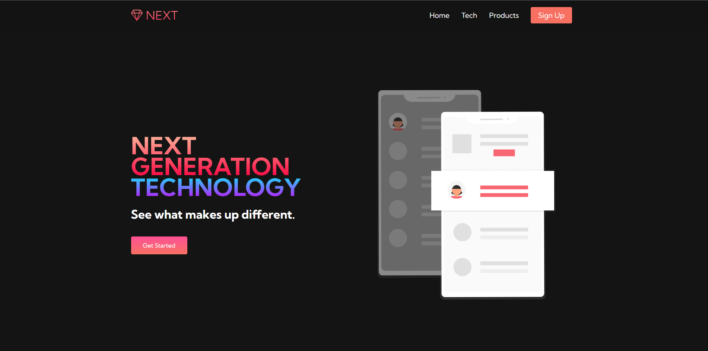
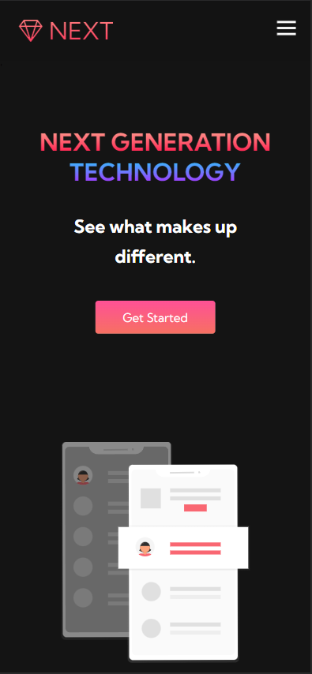

# Table of contents

- [Table of contents](#table-of-contents)
- [OVERVIEW](#overview)
  - [SCREENSHOT](#screenshot)
      - [Desktop View](#desktop-view)
      - [Mobile View](#mobile-view)
  - [LINKS](#links)
- [PROCESS](#process)
    - [What I learned](#what-i-learned)
    - [Useful resources](#useful-resources)

# OVERVIEW

A tutorial website by Brian Design that is responsive.

- [Tutorial](https://www.youtube.com/watch?v=FazgJVnrVuI&list=PLuW735MxtyBUR_1vjXB0DsrzFVEcewEIP&index=7&t=4033s&ab_channel=BrianDesign)

## SCREENSHOT

#### Desktop View

#### Mobile View

## LINKS

- Solution URL: [https://github.com/Atlas-jjs/NEXT-Website]
- Live Site URL: [https://atlas-jjs.github.io/NEXT-Website/]

# PROCESS

### What I learned

- Cool Shortcut Feauture (Shift + Alt + Up/Down Direction)
- Best to do a mobile workflow first 
- Toggle() method either hide() or show() the selected elements
- unDraw is a useful website that contains illustrations and graphics
- Pexels offer free high-quality images
- Create a container to act as wrapper

### Useful resources

- [Bootstrap Icons](https://icons.getbootstrap.com/)
- [unDraw] (https://undraw.co/)
- [Pexels] (https://www.pexels.com/)
